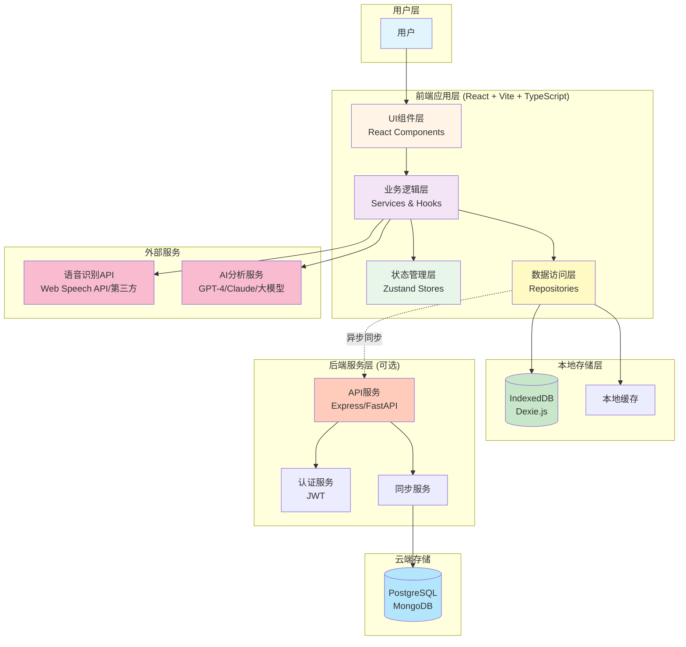
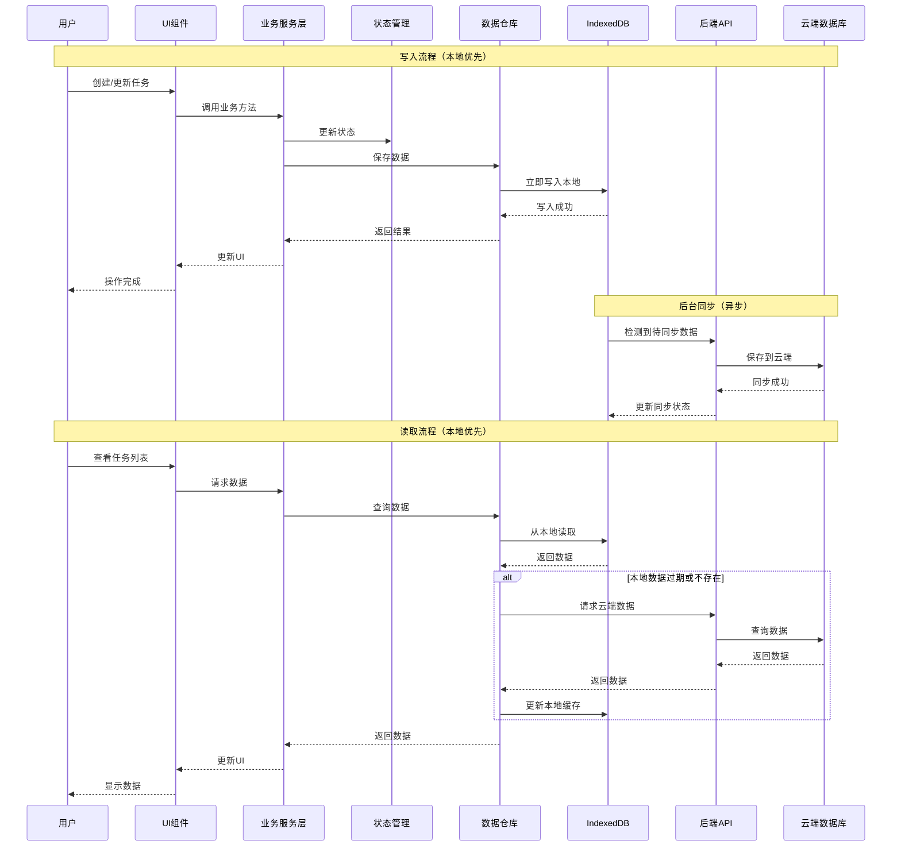
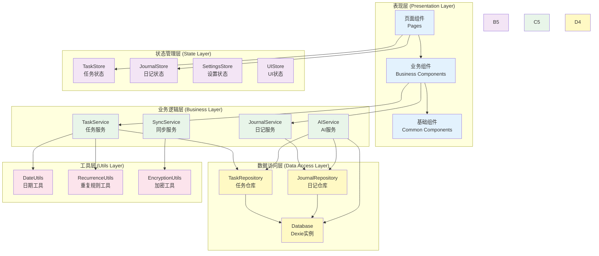
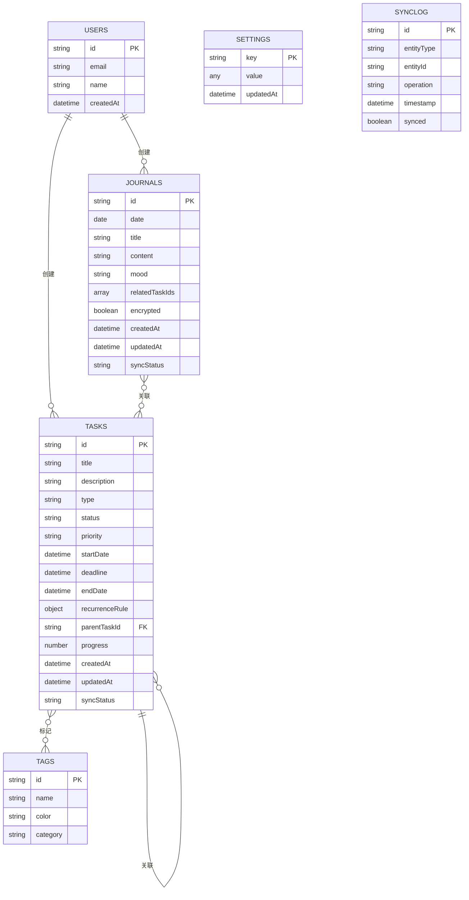
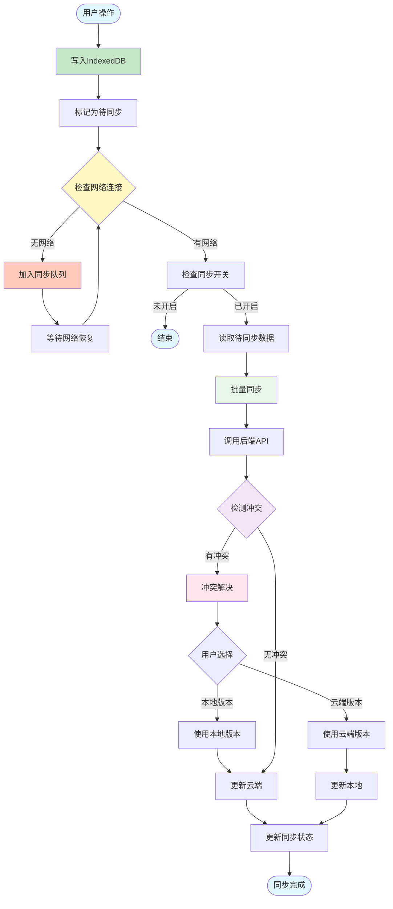
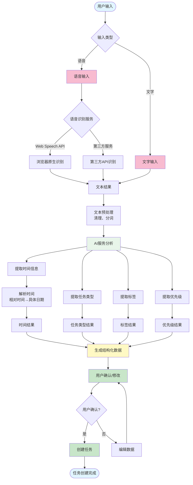
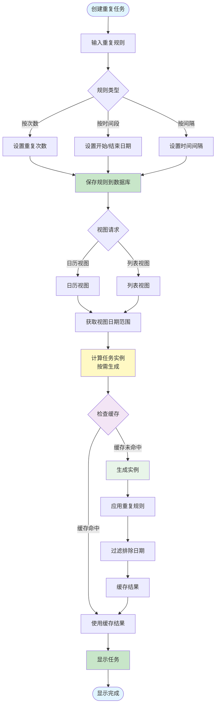
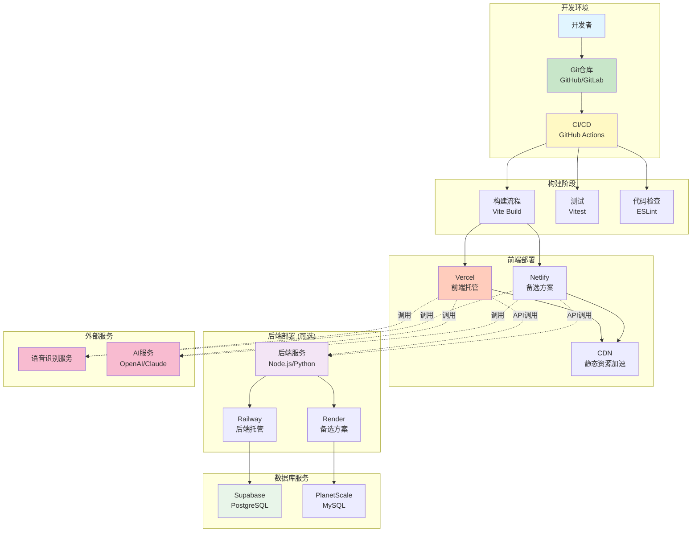
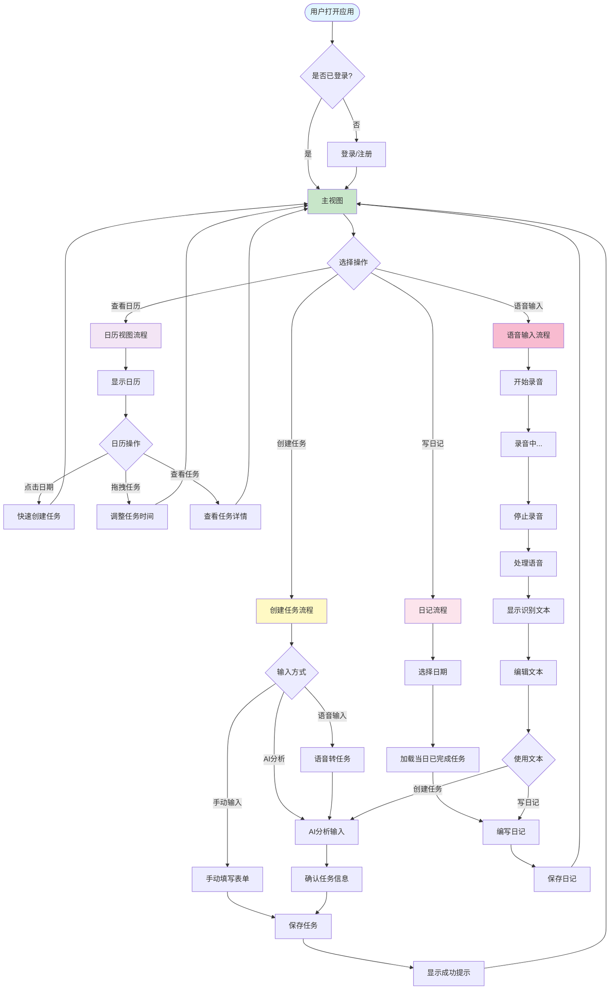

# 技术架构流程图

本文档通过流程图的方式展示系统的技术架构，帮助开发团队更清晰地理解系统设计。

---

## 1. 整体系统架构图



---

## 2. 数据流架构图



---

## 3. 前端架构分层图



---

## 4. 数据存储架构图



---

## 5. 数据同步流程图



---

## 6. AI分析处理流程图



---

## 7. 重复任务生成流程图



---

## 8. 日历视图渲染流程图

```mermaid
flowchart TD
    Start([进入日历视图]) --> ViewType{选择视图类型}
    
    ViewType -->|月视图| MonthView[月视图]
    ViewType -->|周视图| WeekView[周视图]
    ViewType -->|日视图| DayView[日视图]
    
    MonthView --> GetMonthRange[获取月份日期范围]
    WeekView --> GetWeekRange[获取周日期范围]
    DayView --> GetDayRange[获取单日范围]
    
    GetMonthRange --> LoadTasks[加载任务数据]
    GetWeekRange --> LoadTasks
    GetDayRange --> LoadTasks
    
    LoadTasks --> FilterTasks[筛选任务<br/>按日期范围]
    FilterTasks --> ProcessRecurring[处理重复任务<br/>生成实例]
    
    ProcessRecurring --> GroupTasks[按日期分组任务]
    GroupTasks --> RenderCalendar[渲染日历网格]
    
    RenderCalendar --> MonthRender{视图类型}
    MonthRender -->|月视图| RenderMonth[渲染月视图<br/>网格布局]
    MonthRender -->|周视图| RenderWeek[渲染周视图<br/>时间轴布局]
    MonthRender -->|日视图| RenderDay[渲染日视图<br/>详细时间轴]
    
    RenderMonth --> Virtualize{任务过多?}
    Virtualize -->|是| Aggregate[聚合显示<br/>显示"更多"]
    Virtualize -->|否| ShowAll[显示所有任务]
    
    RenderWeek --> VirtualScroll[虚拟滚动<br/>只渲染可见区域]
    RenderDay --> VirtualScroll
    
    Aggregate --> End1([渲染完成])
    ShowAll --> End1
    VirtualScroll --> End1
    
    End1 --> UserInteraction{用户交互}
    UserInteraction -->|点击日期| CreateTask[创建任务]
    UserInteraction -->|拖拽任务| DragTask[拖拽任务]
    UserInteraction -->|点击任务| ViewTask[查看任务详情]
    
    CreateTask --> UpdateCalendar[更新日历]
    DragTask --> UpdateCalendar
    ViewTask --> UpdateCalendar
    UpdateCalendar --> End1
    
    style Start fill:#e1f5ff
    style LoadTasks fill:#c8e6c9
    style ProcessRecurring fill:#fff9c4
    style RenderCalendar fill:#f3e5f5
    style VirtualScroll fill:#e8f5e9
    style End1 fill:#e1f5ff
```

---

## 9. 前端项目结构树状图

```mermaid
graph TD
    Root[src/] --> Components[components/]
    Root --> Pages[pages/]
    Root --> Stores[stores/]
    Root --> Services[services/]
    Root --> Utils[utils/]
    Root --> Hooks[hooks/]
    Root --> Types[types/]
    Root --> DB[db/]
    Root --> API[api/]
    Root --> App[App.tsx]
    
    Components --> Common[common/<br/>基础组件]
    Components --> Calendar[calendar/<br/>日历组件]
    Components --> Task[task/<br/>任务组件]
    Components --> Journal[journal/<br/>日记组件]
    Components --> Voice[voice/<br/>语音组件]
    
    Pages --> TaskList[TaskList/<br/>任务列表页]
    Pages --> CalendarPage[Calendar/<br/>日历页]
    Pages --> JournalPage[Journal/<br/>日记页]
    Pages --> Settings[Settings/<br/>设置页]
    
    Stores --> TaskStore[taskStore.ts]
    Stores --> JournalStore[journalStore.ts]
    Stores --> SettingsStore[settingsStore.ts]
    Stores --> UIStore[uiStore.ts]
    
    Services --> TaskService[taskService.ts]
    Services --> JournalService[journalService.ts]
    Services --> SyncService[syncService.ts]
    Services --> AIService[aiService.ts]
    
    Utils --> DateUtils[dateUtils.ts]
    Utils --> RecurrenceUtils[recurrenceUtils.ts]
    Utils --> Encryption[encryption.ts]
    Utils --> Validators[validators.ts]
    
    Hooks --> UseTasks[useTasks.ts]
    Hooks --> UseCalendar[useCalendar.ts]
    Hooks --> UseVoice[useVoice.ts]
    
    Types --> TaskType[task.ts]
    Types --> JournalType[journal.ts]
    
    DB --> Database[database.ts<br/>Dexie实例]
    DB --> TaskRepo[taskRepository.ts]
    DB --> JournalRepo[journalRepository.ts]
    
    API --> Client[client.ts<br/>API客户端]
    API --> TaskAPI[taskApi.ts]
    API --> SyncAPI[syncApi.ts]
    
    style Root fill:#e1f5ff
    style Components fill:#fff4e6
    style Pages fill:#f3e5f5
    style Stores fill:#e8f5e9
    style Services fill:#fff9c4
    style DB fill:#c8e6c9
    style API fill:#ffccbc
```



---

## 10. 系统部署架构图



---

## 11. 用户操作流程图



---

## 12. 技术栈依赖关系图

```mermaid
graph LR
    subgraph "核心框架"
        React[React 18+]
        Vite[Vite 5+]
        TS[TypeScript]
    end
    
    subgraph "状态管理"
        Zustand[Zustand]
    end
    
    subgraph "路由"
        Router[React Router v6]
    end
    
    subgraph "UI组件"
        AntD[Ant Design]
        AntDMobile[Ant Design Mobile]
    end
    
    subgraph "数据存储"
        Dexie[Dexie.js]
        IDB[IndexedDB]
    end
    
    subgraph "工具库"
        DateFns[date-fns]
        DndKit[@dnd-kit/core]
        Quill[Quill]
        Markdown[react-markdown]
        Recharts[Recharts]
    end
    
    subgraph "后端 (可选)"
        Express[Express/FastAPI]
        Prisma[Prisma/TypeORM]
        JWT[JWT]
    end
    
    subgraph "外部服务"
        WebSpeech[Web Speech API]
        OpenAI[OpenAI API]
    end
    
    React --> Zustand
    React --> Router
    React --> AntD
    React --> AntDMobile
    React --> DndKit
    React --> Quill
    React --> Markdown
    React --> Recharts
    
    Vite --> React
    Vite --> TS
    
    Dexie --> IDB
    
    Express --> Prisma
    Express --> JWT
    
    style React fill:#61dafb
    style Vite fill:#646cff
    style TS fill:#3178c6
    style Zustand fill:#443e49
    style Dexie fill:#ffd54f
    style Express fill:#000000
```

---

## 说明

以上流程图涵盖了系统的核心架构和关键流程：

1. **整体系统架构图** - 展示系统的整体结构和技术栈
2. **数据流架构图** - 展示数据的读写和同步流程
3. **前端架构分层图** - 展示前端的分层架构
4. **数据存储架构图** - 展示数据库设计和关系
5. **数据同步流程图** - 展示本地和云端数据同步机制
6. **AI分析处理流程图** - 展示AI分析任务的完整流程
7. **重复任务生成流程图** - 展示重复任务的计算和生成逻辑
8. **日历视图渲染流程图** - 展示日历视图的渲染和交互流程
9. **前端项目结构树状图** - 展示前端代码组织结构
10. **系统部署架构图** - 展示系统的部署方案
11. **用户操作流程图** - 展示主要用户操作流程
12. **技术栈依赖关系图** - 展示技术栈之间的依赖关系

这些流程图可以帮助开发团队：
- 快速理解系统整体架构
- 明确各模块之间的交互关系
- 指导开发实现
- 便于技术评审和讨论

---

## 使用说明

本文档使用 Mermaid 语法绘制流程图，可以在支持 Mermaid 的 Markdown 编辑器中直接查看，如：
- GitHub
- GitLab
- VS Code (安装 Mermaid 插件)
- 在线工具：https://mermaid.live/

如果您的编辑器不支持 Mermaid，可以将代码复制到上述工具中查看渲染效果。

